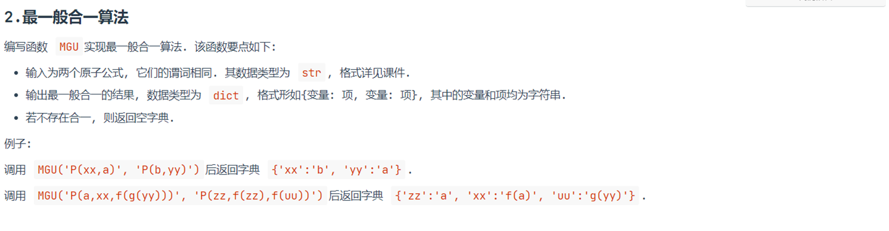

# 一、实验题目

## 题目1

实现命题逻辑的归结推理


## 题目2

实现最一般合一算法




# 二、实验内容

## 1.算法原理

###  1.1 数据结构

1. 存储公式的数据结构

   用**字符串**存储

   - 常量：小写单词或a, b, c等小写字母表示
   - 变量：x,y,z,xx,yy,zz等
   - 谓词：首字母大写的单词或大写字母表示
   - 符号：¬用‘~’代替

2. 存储子句的数据结构

   用**元组（tuple）**存储

3. 存储子句集的数据结构

   用**集合（set）**存储

### 1.2 命题逻辑的归结推理

先将结论去否定，加入子句集中 （此步骤本题中不需要）

反复掉用单步归结，

- 如果能得到空子句，说明子句集不可满足，所以结论成立
- 如果归结直至不产生新子句，且在这个过程中没有得到空子句，则结论不成立


**算法流程：**


### 1.3 最一般合一算法

**合一：** 通过变量替换使得两个子句能够被归结（有相同的原子），所以合一也被定义为使得两个原子公式等价的一组变量替换/赋值

**最一般合一：** 指使得两个原子公式等价，最简单的一组变量替换


**算法流程：**


## 2.关键代码展示

### 2.1题目一的关键代码

#### 2.1.1 判断两个文字是否互补

```python
def isComplement(l1,l2):
    '''
        判断两个文字是否互补
        :param l1: letter1
        :param l2: letter2
        :return:
        若互补，返回True
        否则，返回False
        '''
    if l1.startswith('~'):
        return l1[1:]==l2
    elif l2.startswith('~'):
        return l2[1:]==l1
    else:
        return False
```

#### 2.1.2 命题逻辑的归结推理

```python
def ResolutionProp(KB):
    clauses=[] # 子句集 结构： [{'id':int ,'elements': list }]
    step_str_list=[]
    clause_id=1

    # 处理原有的子句
    for clause in KB:
        # clause为KB中的每一个子句
        elements=list(clause)
        clauses.append({'id':clause_id,'elements':elements})
        step_str=', '.join(elements)
        step_str_list.append(f"{clause_id} ({step_str})")
        clause_id+=1

    processed_pairs=set()
    # processed_clauses=set(tuple( sorted(c['elements'])) for c in clauses)
    new_clauses=clauses.copy()

    while new_clauses:
        new_clauses_copy=new_clauses.copy()
        new_clauses=[]
        for c1 in new_clauses_copy:
            for c2 in clauses:
                if c1['id']>=c2['id']: # 避免重复处理
                    continue
                pair= (c1['id'],c2['id'])
                if pair in processed_pairs: # 说明这一对子句已经处理过
                    continue
                processed_pairs.add(pair)

                # 查找互补对
                for l1 in c1['elements']:
                    for l2 in c2['elements']:

                        # 寻找互补的文字
                        if isComplement(l1,l2):

                            # 生成新的子句
                            new_elements=[]
                            for ll in c1['elements']:
                                if ll!=l1:
                                    new_elements.append(ll)
                            for ll in c2['elements']:
                                if ll!=l2:
                                    new_elements.append(ll)

                            # 生成推理步骤
                            c1_id_str = make_id_str(c1,l1)
                            c2_id_str = make_id_str(c2,l2)

                            new_elements_str=', '.join(new_elements)
                            step_str_list.append(f"{clause_id} "
                                                 f"R[{c1_id_str},{c2_id_str}] = ({new_elements_str})")

                            if not new_elements:
                                return step_str_list

                            new_clauses.append({'id': clause_id, 'elements': new_elements})
                            clauses.append({'id': clause_id, 'elements': new_elements})
                            clause_id += 1

        new_clauses=new_clauses_copy
    return step_str_list
```


### 2.2题目二的关键代码

#### 2.2.1 合一

```python
def unify(term1,term2,subs_map):
    # 合一
    term1_subs = substitute(term1,subs_map)
    term2_subs = substitute(term2, subs_map)

    # 比较两个项是否完全相等
    if deep_equal(term1_subs,term2_subs):
        # 如果完全相等，则直接返回原映射表
        return subs_map.copy()

    # 以下情况是两个项不完全相等
    # 情况1：term1是变量
    if term1['type']=='var':
        return unify_var(term1,term2,subs_map)

    # 情况2：term2是变量
    if term2['type'] == 'var':
        return unify_var(term2,term1,subs_map)

    # 情况3：term1,term2都是函数
    if term1['type'] == 'func' and term2['type'] == 'func':
        if term1['name']!=term2['name'] or len(term1['args'])!=len(term2['args']):
            return None
        for a1,a2 in zip(term1['args'],term2['args']):
            subs_map=unify(a1,a2,subs_map) # 递归
            if subs_map is  None:
                return None
        return subs_map
    return None
```


#### 2.2.2 对变量合一

```python
def unify_var(var,term,subs_map):
    var_name = var['name']
    term=substitute(term,subs_map)

    # 如果 项term 与 变量var 完全相等，说明已经替换过
    if term['type']=='var' and term['name']==var_name:
        return subs_map.copy()
    if occurs_check(var_name, term, subs_map):
        return None

    # 更新替换映射表
    new_subs_map = subs_map.copy()
    new_subs_map[var_name] = term

    # 把替换映射表中的所有变量重新替换一次
    for subs in new_subs_map:
        new_subs_map[subs]=substitute(new_subs_map[subs],new_subs_map)

    return new_subs_map
```


#### 2.2.3 替换

```python
def substitute(term,subs_map):
    # subs_map是替换映射表
    # 替换
    if term['type']=='var':
        # 如果subs_map中有term['name']，则取出替换项，并返回；否则，无法替换，返回term
        return subs_map.get(term['name'],term)
    elif term['type']=='func':
        new_args=[substitute(a,subs_map) for a in term['args']] # 递归
        return {'type':'func','name':term['name'],'args':new_args}
    else:
        # 这时 term['type'] == 'const'
        return term
```


#### 2.2.4 Occur check

```python
def occurs_check(var_name, term, subs_map):
    term = substitute(term, subs_map)
    if term['type'] == 'var':
        return term['name'] == var_name
    elif term['type'] == 'func':
        return any(occurs_check(var_name, arg, subs_map) for arg in term['args']) #递归
    else:
        return False
```


## 3.创新点

### 3.1递归

在题目二中：

采用了**递归**的方式来处理公式中的**函数**，从而可以保证，即使是多层嵌套的函数，也能处理

代码中：在`unify`，`substitute`，`deep_equal`，`occurs_check`函数中都采用了**递归**

篇幅原因，下面仅展示`unify`函数，在**倒数第5行**采用了递归。

```python
def unify(term1,term2,subs_map):
    # 合一
    term1_subs = substitute(term1,subs_map)
    term2_subs = substitute(term2, subs_map)

    # 比较两个项是否完全相等
    if deep_equal(term1_subs,term2_subs):
        # 如果完全相等，则直接返回原映射表
        return subs_map.copy()

    # 以下情况是两个项不完全相等
    # 情况1：term1是变量
    if term1['type']=='var':
        return unify_var(term1,term2,subs_map)

    # 情况2：term2是变量
    if term2['type'] == 'var':
        return unify_var(term2,term1,subs_map)

    # 情况3：term1,term2都是函数
    if term1['type'] == 'func' and term2['type'] == 'func':
        if term1['name']!=term2['name'] or len(term1['args'])!=len(term2['args']):
            return None
        for a1,a2 in zip(term1['args'],term2['args']):
            subs_map=unify(a1,a2,subs_map) # 递归
            if subs_map is  None:
                return None
        return subs_map
    return None
```


### 3.2用栈来解析参数

如果用 `.split(',')` 的方法，而且函数中存在 `','` ，则会导致函数被分隔开，不符合要求。

比如：`f(yy,zz)`，会被分割成 `f(yy` 与 `zz)`

用栈来解析参数，可以避免以上问题。

```python
def split_args(args_str):
    stack=[]
    args_list=[]
    curr_arg_str=[]
    for c in args_str:
        if c==',' and len(stack)==0:
            args_list.append(''.join(curr_arg_str))
            curr_arg_str=[]
        else:
            curr_arg_str.append(c)

            if c=='(':
                stack.append('(')
            elif c==')' and stack:
                stack.pop()

    # 处理最后1个参数
    if curr_arg_str:
        args_list.append(''.join(curr_arg_str))
    return args_list
```


## 4.完整代码

### 题目一完整代码

```python
def isComplement(l1,l2):
    '''
        判断两个子句是否互补
        :param l1: letter1
        :param l2: letter2
        :return:
        若互补，返回True
        否则，返回False
        '''
    if l1.startswith('~'):
        return l1[1:]==l2
    elif l2.startswith('~'):
        return l2[1:]==l1
    else:
        return False

def make_id_str(clause,letter):
    '''
    根据letter在子句中的位置，生成替换中的id（字符串形式）
    :param clause: 子句 结构{'id':int ,'elements': list }
    :return: id_str
    '''
    id_str=str(clause['id'])
    if len(clause['elements'])>1:
        id_str+=chr(97+clause['elements'].index(letter))
    return id_str


def ResolutionProp(KB):
    clauses=[] # 子句集 结构： [{'id':int ,'elements': list }]
    step_str_list=[]
    clause_id=1

    # 处理原有的子句
    for clause in KB:
        # clause为KB中的每一个子句
        elements=list(clause)
        clauses.append({'id':clause_id,'elements':elements})
        step_str=', '.join(elements)
        step_str_list.append(f"{clause_id} ({step_str})")
        clause_id+=1

    processed_pairs=set()
    # processed_clauses=set(tuple( sorted(c['elements'])) for c in clauses)
    new_clauses=clauses.copy()

    while new_clauses:
        new_clauses_copy=new_clauses.copy()
        new_clauses=[]
        for c1 in new_clauses_copy:
            for c2 in clauses:
                if c1['id']>=c2['id']: # 避免重复处理
                    continue
                pair= (c1['id'],c2['id'])
                if pair in processed_pairs: # 说明这一对子句已经处理过
                    continue
                processed_pairs.add(pair)

                # 查找互补对
                for l1 in c1['elements']:
                    for l2 in c2['elements']:

                        # 寻找互补的文字
                        if isComplement(l1,l2):

                            # 生成新的子句
                            new_elements=[]
                            for ll in c1['elements']:
                                if ll!=l1:
                                    new_elements.append(ll)
                            for ll in c2['elements']:
                                if ll!=l2:
                                    new_elements.append(ll)

                            # 生成推理步骤
                            c1_id_str = make_id_str(c1,l1)
                            c2_id_str = make_id_str(c2,l2)

                            new_elements_str=', '.join(new_elements)
                            step_str_list.append(f"{clause_id} "
                                                 f"R[{c1_id_str},{c2_id_str}] = ({new_elements_str})")

                            if not new_elements:
                                return step_str_list

                            new_clauses.append({'id': clause_id, 'elements': new_elements})
                            clauses.append({'id': clause_id, 'elements': new_elements})
                            clause_id += 1

        new_clauses=new_clauses_copy
    return step_str_list

# 测试
KB = {('FirstGrade',), ('~FirstGrade', 'Child'), ('~Child',)}

steps = ResolutionProp(KB)
for step in steps:
    print(step)

```


### 题目二完整代码

```python
def split_args(args_str):
    stack=[]
    args_list=[]
    curr_arg_str=[]
    for c in args_str:
        if c==',' and len(stack)==0:
            args_list.append(''.join(curr_arg_str))
            curr_arg_str=[]
        else:
            curr_arg_str.append(c)

            if c=='(':
                stack.append('(')
            elif c==')' and stack:
                stack.pop()

    # 处理最后1个参数
    if curr_arg_str:
        args_list.append(''.join(curr_arg_str))
    return args_list


def parse_term(term_str):
    # 对项进行解析
    if '(' in term_str:
        # 以第一个'('为函数名与参数的分隔
        func_end_index=term_str.index('(')
        # 提取函数名
        func_name=term_str[:func_end_index]
        # 提取参数
        args=split_args(term_str[func_end_index+1:-1])
        # 递归求所有嵌套的参数
        func_args=[parse_term(a) for a in args]
        return {"type":'func',"name":func_name, "args":func_args}
    elif len(term_str)==1:  # 认为是常量
        return {"type":'const','name':term_str}
    else:  # 认为是变量
        return {"type": 'var', 'name': term_str}

class AtomicFormula:
    def __init__(self,af_str):
        pred_end_index=af_str.index('(')
        self.predicate = af_str[:pred_end_index]  # 提取谓词
        args=split_args(af_str[pred_end_index+1:-1])  # 提取参数
        self.args =[parse_term(a) for a in args]

def substitute(term,subs_map):
    # subs_map是替换映射表
    # 替换
    if term['type']=='var':
        # 如果subs_map中有term['name']，则取出替换项，并返回；否则，无法替换，返回term
        return subs_map.get(term['name'],term)
    elif term['type']=='func':
        new_args=[substitute(a,subs_map) for a in term['args']]
        return {'type':'func','name':term['name'],'args':new_args}
    else:
        # 这时 term['type'] == 'const'
        return term

# 比较两个项是否完全相等
def deep_equal(term1,term2):
    if term1['type']!=term2['type']:
        return False
    if term1['type']=='var':
        return term1['name']==term2['name']
    elif term1['type']=='const':
        return term1['name'] == term2['name']
    elif term1['type']=='func':
        if term1['name'] != term2['name'] or len(term1['args'])!=len(term2['args']) :
            return False

        # 递归比较每一项是否完全相等
        return all(deep_equal(a1,a2) for a1,a2 in zip(term1['args'],term2['args']))
    return False

def occurs_check(var_name, term, subs_map):
    term = substitute(term, subs_map)
    if term['type'] == 'var':
        return term['name'] == var_name
    elif term['type'] == 'func':
        return any(occurs_check(var_name, arg, subs_map) for arg in term['args'])
    else:
        return False

def unify_var(var,term,subs_map):
    var_name = var['name']
    term=substitute(term,subs_map)

    # 如果 项term 与 变量var 完全相等，说明已经替换过
    if term['type']=='var' and term['name']==var_name:
        return subs_map.copy()
    if occurs_check(var_name, term, subs_map):
        return None

    # 更新替换映射表
    new_subs_map = subs_map.copy()
    new_subs_map[var_name] = term

    # 把替换映射表中的所有变量重新替换一次
    for subs in new_subs_map:
        new_subs_map[subs]=substitute(new_subs_map[subs],new_subs_map)

    return new_subs_map

def unify(term1,term2,subs_map):
    # 合一
    term1_subs = substitute(term1,subs_map)
    term2_subs = substitute(term2, subs_map)

    # 比较两个项是否完全相等
    if deep_equal(term1_subs,term2_subs):
        # 如果完全相等，则直接返回原映射表
        return subs_map.copy()

    # 以下情况是两个项不完全相等
    # 情况1：term1是变量
    if term1['type']=='var':
        return unify_var(term1,term2,subs_map)

    # 情况2：term2是变量
    if term2['type'] == 'var':
        return unify_var(term2,term1,subs_map)

    # 情况3：term1,term2都是函数
    if term1['type'] == 'func' and term2['type'] == 'func':
        if term1['name']!=term2['name'] or len(term1['args'])!=len(term2['args']):
            return None
        for a1,a2 in zip(term1['args'],term2['args']):
            subs_map=unify(a1,a2,subs_map)
            if subs_map is  None:
                return None
        return subs_map
    return None

def term_to_string(term):
    if term['type'] == 'var':
        return term['name']
    elif term['type'] == 'const':
        return term['name']
    elif term['type'] == 'func':
        args = ', '.join(term_to_string(arg) for arg in term['args'])
        return f"{term['name']}({args})"

def MGU(af_str1,af_str2):

    af1=AtomicFormula(af_str1)
    af2=AtomicFormula(af_str2)
    if af1.predicate!=af2.predicate:
        raise ValueError("These two atomic formulas have different predicates")
    elif len(af1.args)!=len(af2.args):
        raise ValueError("The numbers of arguments are different")

    subs_map={}  # 初始化替换映射表
    for a1,a2 in zip(af1.args,af2.args):
        unified_subs_map=unify(a1,a2,subs_map)
        if unified_subs_map is None:
            return {}
        subs_map=unified_subs_map

    subs_map_str={}
    for var_name in subs_map:
        term=subs_map[var_name]
        subs_map_str[var_name]=term_to_string(term)

    return subs_map_str


# test
print("Ex1:\n",MGU('P(xx,a)', 'P(b,yy)'))

print("Ex2:\n",MGU('P(a,xx,f(g(yy)))', 'P(zz,f(zz),f(uu))'))

print("Ex3:\n",MGU('Q(a,f(g(h(b)),c))','Q(xx,f(yy,zz))'))

print("Ex4:\n",MGU('P(xx,a,f(g(yy)))', 'P(f(zz),zz,f(uu))'))

```


# 三、实验结果及分析

## 题目一结果

```bash
1 (~Child)
2 (~FirstGrade, Child)
3 (FirstGrade)
4 R[1,2b] = (~FirstGrade)
5 R[2a,3] = (Child)
6 R[3,4] = ()
```

结果正确


## 题目二结果

```bash
Ex1:
 {'xx': 'b', 'yy': 'a'}
Ex2:
 {'zz': 'a', 'xx': 'f(a)', 'uu': 'g(yy)'}
Ex3:
 {'xx': 'a', 'yy': 'g(h(b))', 'zz': 'c'}
Ex4:
 {'xx': 'f(a)', 'zz': 'a', 'uu': 'g(yy)'}
```

结果正确


# 四、参考资料

[1]人工智能（第三版）

[2]人工智能——归结推理-CSDN博客(https://blog.csdn.net/qq_45902301/article/details/125431457)
